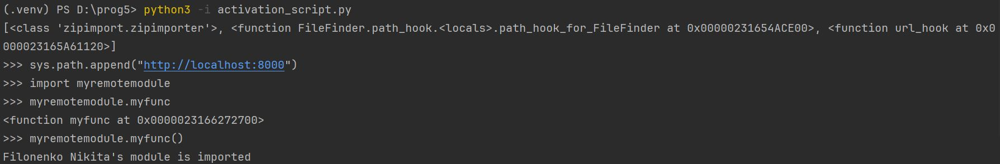

Запуск файлов myremotemodule.py и activation_script локально:

Файлы запускаются из разных мест.
Для получения данных используется библиотека requests.

Для демонстрации удаленного импорта не локально используется  GitHub Pages:

[Созданный репозиторий](https://github.com/sh4rk1350/prog5_lw1)

[Запущенный сайт](https://sh4rk1350.github.io/prog5_lw1/):

Результат работы:

